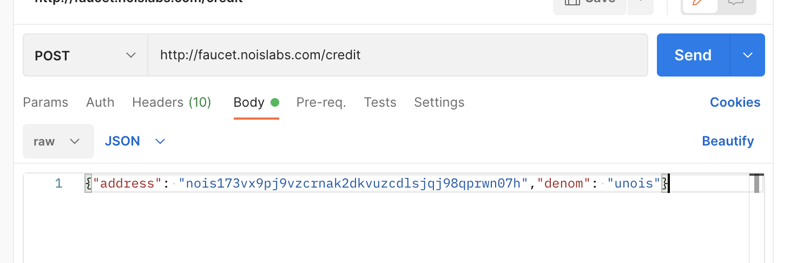

# 🚰 Using the faucet

The faucet can be used via an HTTP POST request.

### With curl

From command line you can use curl:

```shell
curl -X POST \
  -d '{"address": "nois1......","denom": "unois"}' \
  -H "Content-type: application/json" \
  http://faucet.noislabs.com/credit
```

### With Postman

See the folling screenshot:

<figure><figcaption></figcaption></figure>
